[源文件](ori.pdf)

## 注意事项

1. 使用 2B 铅笔在机读卡上作答；
2. 对每个选项进行判断，正确或是涂 T，错误或否涂 F，全部空白或全部填涂不得分；
3. 每题 4 个选项，答对 0 或 1 个选项得 0 分；答对 2 个选项得 0.2 分；答对 3 个选项得 1 分；答对 4 个选项得 2 分；
4. 试卷共 72 题，总计 144 分，答题时间 150 分钟。

## 第一部分：生物化学 分子生物学 细胞生物学

1. 以下都是关于抗体的论述，判断每个选项的正误：
    - A．抗体广泛分布于体液和粘膜系统，在适应性免疫中发挥关键作用；
    - B．抗体需要在细胞质基质中进行糖基化修饰，然后分泌至细胞外；
    - C．Western blot 实验第二抗体通常结合第一抗体的 Fc 片段从而实现信号放大；
    - D．IgG 通过木瓜蛋白酶水解可以获得 Fab 片段，该片段在 PAGE 中为 25kDa 左右。

2. 缺氧诱导因子 1（HIF-1）在介导细胞对低氧的响应中发挥重要作用。丙酮酸激酶 PKM2 受 HIF-1 调控。研究者发现 PHD3 蛋白可催化 PKM2 特定脯氨酸残基的羟化反应，因此提出“PKM2 在 PHD3 的作用下，可作为 HIF-1 的共激活因子”这一假设。请判断以下实验是否可以为这一假设提供证据：
    - A. 在表达 PKM2 细胞与对照细胞中，利用定量 RT-PCR 测定 HIF-1 表达量的变化；
    - B. 在缺氧条件下进行 PKM2 蛋白水平的 Western blot 实验；
    - C. 在过表达 HIF-1 的细胞中测定 PHD3 与 PKM2 表达水平的变化；
    - D. 利用免疫共沉淀实验，探究在不同表达水平的 PHD3 下，PKM2 与 HIF-1 之间的相互作用。

3. 接上题，研究者又分别构建了对照（shSC）和 PHD3 敲低（shPHD3-704）细胞系，随后测定细胞裂解液中葡萄糖含量（图 A）和培养基中乳酸含量（图 B）以及氧消耗率（图 C），DNP 为 2,4-二硝基苯酚。图中*表示与对照组相比，p<0.05；**表示 p<0.01。请判断下列陈述的正误：
    - A. PHD3 水平降低可能通过下调 HIF-1 的活性而导致葡萄糖转运蛋白表达量增高；
    - B. PHD3 水平降低可能通过下调 HIF-1 的活性而导致乳酸脱氢酶 A 表达量减少；
    - C. PHD3 可能通过 HIF-1 间接促进葡萄糖代谢向乳酸生成方向进行；
    - D. PHD3 水平降低可使丙酮酸进入三羧酸循环，增强氧化磷酸化。

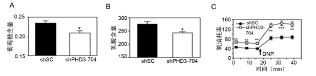

4. 环肽比序列相同的线性肽膜透性好、靶点结合力强。环孢素 A（CsA）是环状 11 肽，能与细胞内的 CypA 结合形成稳定的 CsA–CypA 复合物，发挥免疫抑制作用。判断下列陈述的正误：
    - A. 相比序列相同的线性肽，CsA 没有游离的末端，因此在体内存在时间更长；
    - B. CsA 有多个氨基酸存在甲基化，导致其极性增强，可更好地穿透细胞膜；
    - C. 与 CsA 相比，其序列相同的线性肽具有更强的免疫抑制功能；
    - D. CsA 与序列相同的线性肽的等电点相同。

5. 将培养的小鼠细胞与 14C 标记的 Leu 进行孵育，经过漂洗和裂解后，在 NaCl 溶液中高速离心，得到可溶性组分（含有 RNA 和蛋白质）和主要含有核糖体的沉淀（如图）。判断下列陈述的正误：
    - A. 沉淀组分中蛋白质曲线说明，核糖体在 20 分钟内持续不断掺入氨基酸；
    - B. 可溶组分中蛋白质曲线说明，有一些蛋白质在核糖体外合成；
    - C. 沉淀组分中 RNA 曲线说明，核糖体 RNA 很快被氨基酸标记；
    - D. 右图支持氨基酸先与可溶组分中的 RNA 结合，之后转移到核糖体上。

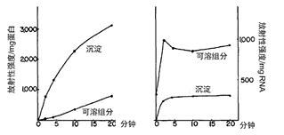

6~7．对 XLF 蛋白的乳酸化修饰进行研究。在细胞中分别转染带有 HA 的野生型 XLF（*HA-XLF* 或 *HA-XLF WT*）或者第 288 位 Lys 突变为 Arg 的突变体（*HA-XLF KR*），以及带有 MYC 的 GCN5 的表达载体（*MYC-GCN5*）。GCN5 调控 XLF 乳酸化。用乳酸钠（NALA）处理细胞（图 A，B），然后通过免疫沉淀实验检测细胞中 XLF 的乳酸化和乙酰化，以及非同源末端连接（NHEJ）效率（图 C）。

6. 根据上述实验结果，判断下列陈述的正误：
    - A. 细胞内乳酸的增加能促进 XLF 的乳酸化修饰和乙酰化修饰；
    - B. 288 位 Lys 是 XLF 的主要乳酸化修饰位点；
    - C. GCN5 能促进野生型和突变体 XLF 的乳酸化修饰；
    - D. XLF 的 288 位点与 NHEJ 修复有关。

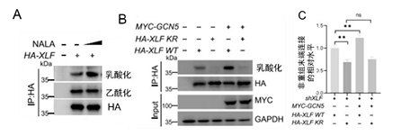

7. 如下图所示，在未处理或辐射（IR）处理的细胞中，检测了第 5、83、89、280、387 以及 570 位 Ser（S）突变为 Ala（A）后 GCN5 的磷酸化（p-SQ/TQ）（图 A），以及野生型 GCN5（WT）或突变体与 XLF 的相互作用（图 B），在敲低 GCN5 (shGCN5) 细胞中回补野生型及其突变体后 NHEJ 修复效率的差异（图 C）。根据实验结果，判断以下陈述的正误：
    - A. GCN5 的磷酸化修饰受到 IR 处理的正调控； 
    - B. GCN5 上述丝氨酸位点中第 5 位最关键；
    - C. GCN5 第 5 位的丝氨酸磷酸化修饰抑制 GCN5 与 XLF 的相互作用；
    - D. 在 GCN5 敲低细胞中回补 GCN5 S5A 突变体才能挽救 NHEJ 的修复效率。

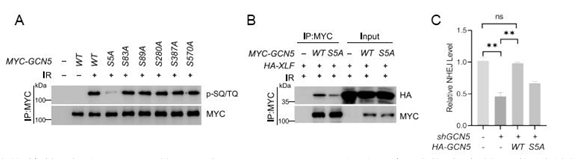

8~9 体外合成的未修饰 mRNA 会诱导树突状细胞（DCs）产生高水平的细胞因子（如 TNF-α、IL-8），而哺乳动物的 RNA 则表现出极低的免疫原性。为了探究这一现象的分子机制，提取不同来源的 RNA，或者通过体外转录（IVT）合成带有修饰核苷（如假尿苷 Ψ、5-甲基胞苷 m5C 等）的 RNA，随后将 RNA 导入 DCs（图 A）或表达特定受体蛋白 TLR 的 HEK293 细胞（图 B）中，观察细胞的激活情况。

8. 根据实验结果图 A，判断以下陈述的正误：
    - A. 哺乳动物的总 RNA、核 RNA 和胞质 RNA 诱导 TNF-α 的能力均低于体外转录的 RNA；
    - B. 线粒体 RNA 诱导免疫反应的能力极弱，这与其进化起源于内共生细菌有关；
    - C. 细菌总 RNA 对 DCs 的激活作用可被 RNase 抑制，说明活性成分是 RNA 而非内毒素；
    - D. tRNA 无论是哺乳动物来源还是细菌来源，均不能诱导任何水平的 TNF-α 分泌。

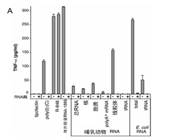

9. 根据图 B 及相关原理，判断陈述的正误：
    - A. TLR3、7 和 8 均能响应未修饰的 RNA，对不同修饰的敏感性存在差异；
    - B. RNA 中掺入 Ψ 或 m5C 可以完全抑制 TLR3 的激活，但不能抑制 TLR7 的激活；
    - C. m6A 和 s2U 修饰能够抑制 TLR3、TLR7 和TLR8 的信号转导；
    - D. Ψ 对 TLR7 和 TLR8 介导的免疫激活具有显著抑制作用，但对 TLR3 的抑制效果有限。

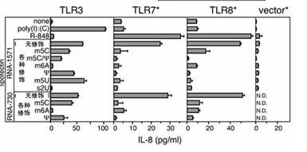

10. 外泌体是细胞释放到细胞外环境的小型囊泡。研究者从小鼠细胞培养物中纯化出外泌体。右图左侧显示细胞 RNA 及外泌体RNA 的检测结果，横轴和纵轴分别表示 RNA 分子的迁移时间和含量（荧光强度 FU）。右侧显示用Poly(dT)作引物，将外泌体 RNA 作为模板合成 cDNA 的电泳结果。由此判断下列叙述的正误：
    - A. 外泌体中含有分子量大小不同的 RNA；
    - B. 与供体细胞相比，外泌体的 rRNA 几乎没有或很少；
    - C. 外泌体及其供体细胞均检测到小于 18S 的 RNA；
    - D. 外泌体中含有 mRNA。

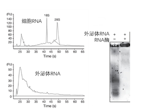

11. E-钙黏蛋白介导的细胞连接对维持上皮组织的稳态起关键作用，上皮来源的肿瘤获得侵袭性表型时常常伴随 E-钙黏蛋白下调或缺失。为探讨 E-钙黏蛋白与转录因子 Snail 之间的关系，研究者在一组人类癌细胞系中分析了二者的表达，RT-PCR 实验结果如右图。判断下列陈述的正误：
    - A. 不同癌细胞系中 E-钙黏蛋白和 Snail 的表达呈正相关；
    - B. Snail 在高侵袭性癌细胞系中高表达；
    - C. 此图说明 T24 中 E-钙黏蛋白启动子发生了高度甲基化；
    - D. Snail 可作为肿瘤侵袭性/

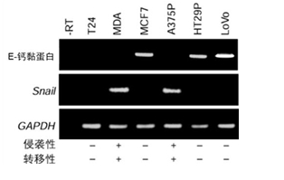

12. 线粒体在细胞衰老过程中有重要功能，判断下列陈述的正误：
    - A. 线粒体正常能量代谢过程中的产物也会参与细胞衰老进程；
    - B. 自噬清除受损的线粒体有利于延缓细胞衰老进程；
    - C. 线粒体 DNA 会积累突变，从而影响其功能，加速衰老进程；
    - D. 衰老细胞的线粒体出现代谢重编程，提高其 ATP 的生成效率。

13. CAR-T 细胞中主要嵌合了 B 细胞受体的抗原识别区和 T 细胞受体的胞内信号转导区，使 CAR 实现了识别肿瘤细胞并激活 T 细胞的功能，提高了免疫系统的肿瘤杀伤能力。判断下列相关陈述的正误：
    - A. CAR 识别肿瘤表面抗原的过程不依赖主要组织相容性复合体的呈递；
    - B. 降低 CAR-T 细胞的免疫因子风暴副作用的主要手段是更换 CAR 的抗原识别区；
    - C. 抗体的抗原识别区能应用于 CAR-T 细胞主要因为 B 细胞和 T 细胞都属于淋巴细胞；
    - D. NK 细胞也属于淋巴细胞，因此 CAR 的胞内信号转导区可在 NK 

14. 下图显示了 *Apaf1* 缺陷与 *Caspase 9* 缺陷两组新生小鼠的趾发育表型，结合所学，判断下列关于二者凋亡通路功能描述的正误：
    - A. 由图可知 Apaf1 在 Caspase 9 的上游发挥作用；
    - B. 趾间蹼的清除过程中，Apaf1 是凋亡能正常进行的必需分子；
    - C. Caspase 9 缺陷小鼠趾间发育正常，说明趾间细胞的凋亡不依赖线粒体介导的凋亡通路；
    - D.  $Apaf1^{-/-}$ 小鼠无法清除趾间蹼，说明 Apaf1 可直接切割效应 Caspase 从而诱导细胞凋亡。

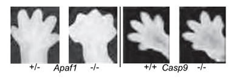

15. 通过表型实验发现基因 X 或基因 Y 的肝脏特异性敲除小鼠均出现相似的病理特征，通过免疫荧光观察到对应的蛋白 X 与蛋白 Y 共定位于同一亚细胞结构。为进一步研究这两种蛋白之间是否存在互作，判断以下操作是否有助于达到研究目的：
    - A. 可用AlphaFold预测两种蛋白的结构及互作可能；
    - B. 可用凝胶迁移实验检测蛋白与探针是否结合；
    - C. 可采用免疫共沉淀联合 Western blot； 
    - D. 可利用染色质免疫共沉淀联合高通量测序

16. 对下列有关细胞膜结构与功能的陈述进行正误判断：
    - A. 磷脂分子与膜蛋白均可在磷脂双分子层中进行自由的侧向移动与跨双层翻转；
    - B. 真核细胞质膜中带负电的磷脂酰丝氨酸、磷脂酰乙醇胺主要分布在胞外侧小叶；
    - C. 通过高盐溶液即可将外周膜蛋白从膜上洗脱下来；
    - D. 脂筏区域的流动性显著低于周围的磷脂双分子层。

17. 对下列有关真核细胞内质网功能与蛋白分选的陈述进行正误判断：
    - A. 内质网是磷脂合成的核心场所，新合成的磷脂会进入内质网膜的胞质侧小叶；
    - B. 内质网驻留蛋白被输送到高尔基体后，通过 COPII 包被的囊泡被运回内质网；
    - C. 溶酶体酶可通过甘露糖-6-磷酸信号被分选到溶酶体；
    - D. 内质网识别并降解错误折叠蛋白的过程，需要泛素-蛋白酶体参与。

18. 基因组 DNA 的琼脂糖电泳呈现梯状条带是细胞凋亡的核心特征之一。血清饥饿处理不同培养条件的细胞后，提取细胞内可溶性 DNA 进行电泳，结果如下图，其中 PE 为 PKC 通路激活剂。判断下列有关陈述的正误：
    - A. 血清饥饿可诱导细胞凋亡，凋亡过程本身不依赖 Ras 蛋白的功能；
    - B. EGF、Insulin 和 NGF 能显著抑制血清饥饿诱导的凋亡；
    - C. NGF 和 EGF 的抗凋亡作用均依赖于 Ras 蛋白；
    - D. 细胞坏死同样会具有 DNA 梯状条带的特征。

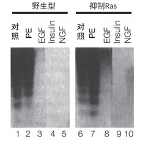

## 第二部分：微生物学 植物学 植物生理学

19. 根据对病毒复制及基因表达的了解，判断下列陈述的正误：
    - A. 单链 DNA 病毒基因组直接转录产生 mRNA；
    - B. 具有逆转录过程的病毒既有 RNA 病毒也有 DNA 病毒；
    - C. 病毒基因组的复制过程不存在基因组的剪切；
    - D. 单链(+)RNA 病毒侵入后，所有基因均直接翻译产生蛋白质。

20. λ 噬菌体感染大肠杆菌时可进入裂解途径或溶源途径(图①)。当其某种基因突变时，感染非溶源状态的细菌后 λ 噬菌体只能进入裂解途径(图②)，该突变型噬菌体感染溶源状态的细菌时不能进行核酸复制(图③)。请结合这些信息和病毒学常识，判断以下相关陈述的正误：
    - A. ①中所产生的子代病毒称为原噬菌体；
    - B. cI 基因发生突变会造成②所示的现象；
    - C. 溶源性细菌对该 λ 噬菌体具有免疫性；
    - D. λ 噬菌体感染②与③混合细菌后，进入裂解状态。

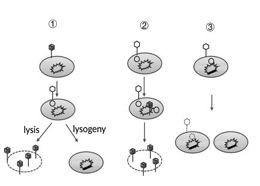

21. 对以下关于光合细菌的陈述判断正误：
    - A. 蓝细菌可进行光合作用来固定 CO2； 
    - B. 蓝细菌通过环式光合磷酸化产生 NADPH；
    - C. 绿硫细菌可利用 H2S 作为电子供体； 
    - D. 紫硫细菌以 CO2 作为唯一碳源并释放氧气。

22. 对以下非光合细菌固碳的相关陈述判断正误：
    - A. 非光合细菌可以 CO2作为碳源，称为化能异养型；
    - B. 化能异养型细菌通过卡尔文循环进行固碳； 
    - C. 硝化细菌依赖还原乙酰辅酶 A 途径进行固碳；
    - D. 硫氧化细菌通过对还原态无机硫化物进行氧化获取能量。

23. 对下列有关培养基的陈述判断正误：
    - A. 微生物培养中，种子培养基和发酵培养基的配方通常相同，以缩短菌种从种子罐转移到发酵罐时的适应期，提高发酵速度；
    - B. 在伊红美蓝培养基（EMB）中，沙门氏菌的菌落不呈现金属光泽；
    - C. 用于筛选产蛋白酶微生物的牛奶培养基属于选择培养基；
    - D. 使用常规的 LB 培养基分离海水中的细菌是合理的选择。

24. 叶绿素及其他光合色素的吸收光谱如图所示。对以下陈述进行正误判断：
    - A. 叶绿素 a 与叶绿素 b 因化学结构的差异而呈现不同的吸收光谱；
    - B. 叶绿素在蓝光和红光范围的吸收较强，而对绿色光吸收较弱，从而叶片呈现绿色；
    - C. 类胡萝卜素在保护光合器官以防止光氧化损伤方面具有重要功能；
    - D. 一些藻类能在深海生存是因为藻红素可高效吸收穿透至较深海域的紫光。

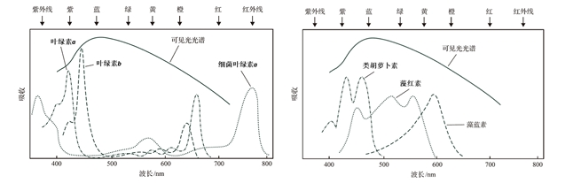

25~27. 下图为三种植物生殖结构的切片图。

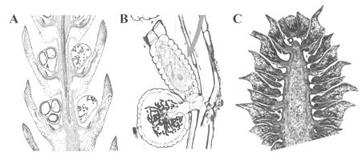

25. 判断以下论述的正误：
    - A. 图 A 中有大孢子叶和小孢子叶，分别产生大孢子囊和小孢子囊；
    - B. 图 A 中的生殖结构可产生大孢子和小孢子，有性生殖方式是异配生殖；
    - C. 图 B 中有大孢子囊和小孢子囊，分别产生大孢子和小孢子；
    - D. 图 B 中的生殖结构分别产生卵和精子，有性生殖方式是卵式生殖。

26. 观察图 C，并结合相关知识，判断以下论述正确或错误：
    - A. 图中可以观察到两种形态的孢子叶； 
    - B. 图中的结构可产生大孢子囊和小孢子囊；
    - C. 图中的生殖结构只能产生大孢子，进而形成颈卵器和卵细胞；
    - D. 该植物的大孢子叶基部近轴面应着生一枚胚珠。

27. 比较图 A、图 B 和图 C，并结合相关知识，判断以下论述正确或错误：
    - A. 三个图中的营养细胞均是孢子体细胞； 
    - B. 三个图中均显示了有性生殖结构；
    - C. 图 A 和图 B 的结构均可形成雄配子；
    - D. 图 B 和图 C 的结构均可形成雌配子。

28. 将鸭跖草离体叶片分别培养在不同浓度的硝酸盐（图 A）、铵盐（图 B）、KCl（图 C）和 NaCl（图D）中，各组分别添加（黑色柱）或不添加（斜线柱）终浓度为 2 μM 的 ABA。1 小时后，测定叶片气孔导度（Y 轴），X轴为无机盐浓度。各图中斜线柱数据间无统计学差异，B 图中 15 和 20 mM 两组数据内的 ABA 与对照间无统计学差异，其它各组数据内的 ABA 与对照间有统计学差异。根据实验结果和相关基础知识，判断下列陈述的正误：
    - A. 在不施加 ABA 的情况下，用无机盐处理不影响叶片气孔导度的原因主要是生理条件下这些无机离子在保卫细胞中不存在；
    - B. 增加硝酸盐浓度可提高气孔对 ABA 的敏感性，而增加铵盐浓度会降低这种敏感性；
    - C. KCl 与 NaCl 处理也能显著改变气孔对 ABA 的响应，作用与硝酸盐类似；
    - D. 气孔导度对 ABA 敏感性与钙离子无关。

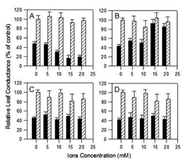

29~30：为研究细胞分裂素的调控机制，科学家进行了下面实验：

29. 通过 microRNA 敲低 *PUP14*（*amiRPUP14*）后，可观察到与野生型（Col0）不同的表型，如图 A。根据已有生物学知识和实验结果，对以下陈述判断正误：
    - A. 高浓度细胞分裂素促进根的伸长；
    - B. 在组织培养中外源添加细胞分裂素促进根的形成；
    - C. PUP14 基因是地上部分生长和根伸长必需的基因；
    - D. PUP14 功能缺失可导致与细胞分裂素信号缺乏相似的表型。

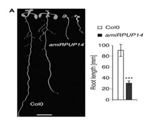

30. 对植株的表型进行观察，结果如图 B 和 C 所示。根据已有生物学知识和实验结果，判断下列陈述的正误：
    - A. 植物细胞分裂素缺乏会导致分枝增多；
    - B. PUP14 是抑制分枝的重要因子；
    - C. 降低 PUP14 的功能可导致花原基增多；
    - D. PUP14 影响花的排列方式。

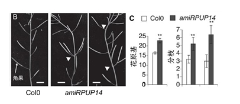

31~32. 为研究种子大小的调控机制，科学家做了以下实验（种子大小以千粒重表示）。

31. *mee45-1* 是 *MEE45* 基因功能缺失突变体。在*mee45-1* 中，用其自身启动子驱动表达 *MEE45* 的 3 个转基因株系 *mM451~3*，以及在野生型 WT 背景下用其自身启动子驱动表达 *MEE45* 的 3 个转基因株系 *M451~3*，与 WT 对照的种子重量统计结果如图 A 所示。根据已有生物学知识和实验结果，判断下列陈述的正误：
    - A. *MEE45* 负调控种子大小；
    - B. 在 *mee45-1* 中表达 *MEE45*，种子恢复为野生型表型；
    - C. 遗传互补实验可以确定突变体表型是否由某个基因突变造成；
    - D. 种子大小与 *MEE45* 的剂量有关。

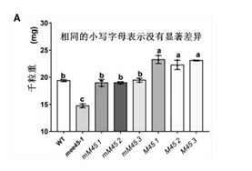

32. 进一步分析了生长素在 *MEE45* 调控种子大小中的作用，YUC 是合成生长素的关键酶。在 *mee45-1* 突变体背景下用 *MEE45* 启动子或珠被特异的 *INO* 启动子驱动 *YUC4* 表达的转基因植株、在三重突变体 *yuc1* *yuc4* *yuc10* 背景下用 35S 启动子驱动 *MEE45* 过量表达的转基因植株，以及 WT 等植株的种子大小统计数据如图 C 所示。根据已有生物学知识和实验结果，判断下列陈述的正误：
    - A. 生长素缺乏可导致种子变大；
    - B. 突变体 *mee45* 表型与生长素减少的表型相似；
    - C. *YUC* 基因位于 *MEE45* 的上游；
    - D. 过量表达 *YUC4* 或 *MEE45* 均可导致种子变大。

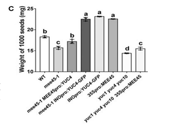

33~34. 苔藓植物包括苔类、藓类和角苔类三大分支，是现存起源最早的陆生植物类群。根据下图及其相关信息，回答下述两个问题。

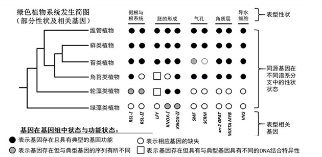

33. 苔藓植物拥有一系列有别于其它类群的显著特征，这些特征也显示苔藓植物是最早登陆的现生陆生植物类群。判断以下表述正确与否：
    - A．苔藓植物是一单系类群 
    - B. 轮藻类是苔藓植物的姐妹群
    - C. 苔类与角苔类是并系类群
    - D. 胚的形成是苔藓植物的共有衍征

34. 植物在登陆过程中产生了许多创新性性状，即在祖先类群中从未存在的性状。根据表型相关基因，
判断以下表述的正确与否：
    - A．调控胚形成的基因最早出现在苔藓植物；
    - B．根据演化的简约性原则，苔类植物叶状营养体上没有气孔是一种祖征；
    - C．角质层与导水细胞的形成是苔藓植物的创新性性状；
    - D．陆生植物的多基因性状，如假根/根系统、胚的形成等是逐渐形成的。

35. 买麻藤纲是裸子植物中一单系群，与其他裸子植物有很大不同，请判断以下表述的正误：
    - A. 该纲为藤本或灌木，茎节明显，叶片大，具网状叶脉；
    - B. 该纲部分植物的木质部具有导管，其他裸子植物仅具管胞；
    - C. 该纲植物具有类似花被的盖被结构；
    - D. 该纲都具有双受精现象，是最接近被子植物的裸子植物。

36. 买麻藤纲的麻黄科、买麻藤科和百岁兰科在形态上差异巨大，判断以下对这种形态差异解释的正误：
    - A．适应不同生态环境趋异演化的结果；
    - B．长期的地理隔离与遗传分化的结果；
    - C．它们不享有最近的共同祖先； 
    - D．不同的生存和繁殖策略所致。

## 第三部分： 动物学 生理学 生态学

37. 爬行动物通常生有牙齿，判断下列相关描述的正确与错误。
    - A. 蜥蜴的牙齿通常着生在颌骨的顶面，称为端生齿；
    - B. 蛇的牙齿通常着生在颌骨边缘的外侧，称为侧生齿；
    - C. 鳄的牙齿通常着生在颌骨的齿槽内，称为槽生齿；
    - D. 绝大多数爬行动物的牙齿均呈圆锥形，属于同型齿，主要功能是咬捕食物而非咀嚼。

38. 判断下列有关哺乳动物内分泌系统描述的正确与错误。
    - A. 腺垂体来源于间脑底部向下的突出，神经垂体来源于原始口腔顶部的突出；
    - B. 神经垂体可分泌催产素，具有催产和乳腺排乳的作用；
    - C. 腺垂体可分泌促卵泡激素，能促进雌兽卵巢中卵泡的加速成熟；
    - D. 腺垂体可分泌促性腺激素，作用于雌兽乳腺分泌催乳激素。

39. 判断下列有关蟾蜍泄殖系统描述的正确与错误：
    - A. 由精巢发出许多细小的输出精管通入肾脏，连接中肾管，中肾管兼具输精和输尿作用；
    - B. 尿液经输尿管进入膀胱，膀胱有口连接泄殖腔，膀胱有重吸收水分的功能；
    - C. 卵巢一对，卵成熟后穿破卵巢壁进入体腔，再经喇叭口进入输卵管下行；
    - D. 雄性摘除精巢后，毕氏器会发育为卵巢，中肾管发育为输卵管，性别转变为雌性。

40. 判断下列有关鸟类羽毛描述的正确与错误：
    - A. 正羽主要着生在翼及尾上，正羽羽片覆盖区域没有羽毛生长，毛羽着生在正羽之间；
    - B. 绒羽的羽柄甚短，其顶端发出细长丝状的羽枝，羽小枝上没有钩；
    - C. 在羽毛发生过程中，首先是在真皮层表面积聚的间充质形成隆起；
    - D. 羽毛的红色属于化学性色彩，蓝色属于物理性色彩。

41. 判断下列有关软体动物神经系统描述的正确与错误：
    - A. 石鳖的神经系统包括围食道神经环及向后伸出的侧神经索和脏神经索各一条；
    - B. 田螺的神经系统有 4 对主要的神经节：脑神经节、侧神经节、足神经节和口球神经节；
    - C. 河蚌具有 3 对神经节：脑神经节、足神经节和侧神经节；
    - D. 乌贼的脑神经节和足神经节属于中枢神经系统，星芒状神经节属于周围神经系统。

42. 血液承担着运输氧气的作用，对以下相关陈述进行正确或错误判断：
    - A. 兔的肺动脉血比肺静脉血含氧量高；
    - B. 狗的冠状动脉血比冠状静脉血含氧量高；
    - C. 鲤鱼的出心血比回心血含氧量高；
    - D. 鲤鱼的入鳃血比出鳃血含氧量高。

43. 对以下关于动物发育过程的描述进行正确或错误判断：
    - A. 文昌鱼幼体游泳生活，经变态发育为成体后营底栖生活，过滤取食；
    - B. 海鞘从幼体到成体的发育过程中尾部逐渐消失，脊索和神经系统退化，鳃裂萎缩；
    - C. 藤壶幼体浮游生活，变态发育为成体营固着生活，并分泌产生钙质外壳；
    - D. 海参幼体变态发育为成体，从幼体的两侧对称转变为成体的五辐射对称。

44. 愈合尾综骨的出现对于鸟类飞行具有促进作用。请对以下相关描述判断正误：
    - A. 尾综骨的出现使得鸟类身体重心前移；
    - B. 尾综骨的出现有利于加快排泄物排出；
    - C. 尾综骨的出现有利于产更大型的卵；
    - D. 尾综骨的出现可以加强对尾羽的操控。

45. Hodgkin 与 Huxley 发表了数篇开创性论文，奠定了动作电位的离子机制。他们利用乌贼巨大轴突和电压钳技术，首次定量描述了在动作电位（-v）期间的总电导（g）以及 Na⁺和 K⁺的电导（gNa、gK）变化（如图）。判断以下陈述的正误：
    - A. 在动作电位的上升阶段，电压门控钠通道大量开放，此时 Na⁺内流的速率完全由通道开放数量决定，与 Na⁺电化学驱动力无关；
    - B. 若将一个细胞的膜电容加倍（假设膜面积增大但其他电生理特性保持不变），则同样强度的 gNa变化引起的膜电位去极化幅度将减小；
    - C. 在动作电位峰值期间，膜电位接近但不会超过 Na⁺平衡电位；
    - D. 单次动作电位期间流入细胞的 Na⁺数量显著改变细胞内 Na⁺浓度，因此必须依赖 Na⁺-K⁺泵迅速将大量 Na⁺排出细胞，否则下次动作电位不会发生。

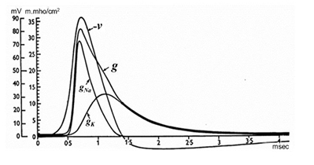

46. 在经典的肌丝滑行模型中，肌肉收缩由肌球蛋白头部与细肌丝之间 ATP 驱动的横桥循环产生主动张力。后来发现，肌小节中还存在被动弹性元件，在肌肉受力过程中可以储存和释放弹性势能。下图通过消化 titin 蛋白破坏肌小节中的弹性元件（左图），在不同肌小节长度下测定弹性变化（右图，箭头上方的数字是弹性变化的百分比）。图中未标对照和实验组别，请自行判断。判断下列陈述的正误：
    - A. 因为消化 titin 蛋白降低了收缩力，所以 titin 参与横桥产生力的过程；
    - B. 消化 titin 蛋白后，肌小节在受到拉伸后恢复原长度的能力降低；
    - C. 消化 titin 蛋白减少了横桥做功的阻力，所以等长收缩的最大主动张力会上升；
    - D. 消化 titin 蛋白后，粗肌丝上能与细肌丝结合的横桥数量变得参差不齐。

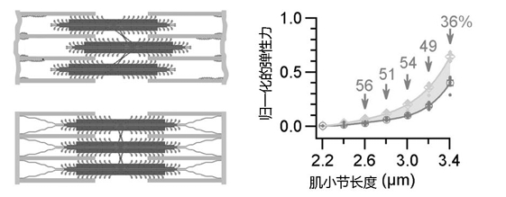

47. 心电图是心脏功能检测的最常用方法之一。该图是一个家族性心律失常病人在安静和剧烈运动半分钟后的代表性心电图。请判断该病人在运动后是否出现了如下现象：
    - A. 窦性早搏 
    - B. 期前收缩 
    - C. 代偿间歇
    - D. Q-T 间期延长

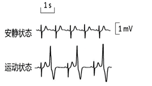

48. 血流动力学涉及压力、流量、血管弹性以及血液粘度等参量。判断下列陈述是否正确：
    - A. 层流条件下，若血管半径加倍，其他条件不变，则在相同压力差下血流量也将加倍；
    - B. 左心室收缩时，部分能量储存于大血管壁的弹性形变中，从而心室舒张期仍能维持血流；
    - C. 在稳态层流条件下，若压力差保持不变，而血液黏度升高，则血流量减少；同时血管内速度分布仍保持中心最大、管壁处接近零的特征；
    - D. 若大血管弹性明显降低，则在相同搏出量条件下，动脉压力的脉动幅度往往减小。

49. 右图是血红蛋白（Hb）氧解离曲线。判断下列陈述正确与否：
    - A. 跟正常人比，呼吸性碱中毒者 Hb 的氧解离曲线右移；
    - B. 长跑比赛中骨骼肌血管中 Hb 的氧解离曲线发生左移；
    - C. 从成都刚到拉萨时，Hb 的氧解离程度增加；
    - D. 低体温的情况下，Hb 的氧解离曲线发生左移。

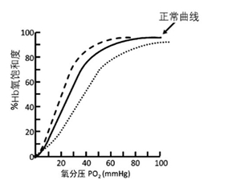

50. 健康人肾脏对糖的处理如图。请结合相关知识和图中信息判断下列陈述正确与否：
    - A. 图中的正常血糖是指空腹血糖；
    - B. 某糖尿病人血糖水平在正常范围内，说明其肾糖阈右移了；
    - C. 无糖尿的健康成人的血糖水平通常不会超过 10 mmol/L；
    - D. 低血糖情况下，原尿中的糖浓度偏高。

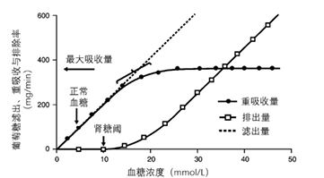

51. 右图展示了两种不同生理条件下（两个实验组）肾小管液渗透压在肾单位不同取样部位的相对变化。请判断下列陈述的正误：
    - A. 本图有误，髓袢液处的两条曲线中，下面那条应为虚线；
    - B. 实线代表正常生理状态；
    - C. 原尿经过近曲小管和髓袢的水盐重吸收和逆流倍增，形成高渗的小管液进入远曲小管；
    - D. 虚线所示条件下，心房钠尿肽分泌量较正常生理状态高。

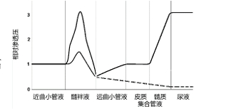

52. 哺乳动物代谢率和体重的统计数据如图所示。请根据相关知识判断下列陈述的正误：
    - A. 小型哺乳动物高代谢率的主要优势之一是可以降低食物需求，使其在食物匮乏的环境中更具生存优势；
    - B. 有人认为单位体表面积的基础代谢率在不同体重的哺乳动物之间相对恒定。图中数据为否定这一观点提供了有力证据；
    - C. 此图不能用于预测变温动物的代谢率；
    - D. 人的体重是小鼠的 1000 多倍，因此人每天所需的食物热量大约应是小鼠的 100 多倍。

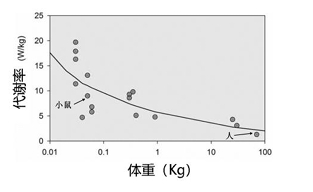

53. 婚配系统是动物种群社群结构与繁殖体系的关键特征，常见的婚配系统包括单配制、多配制、混交制等。请对以下关于鸟类和兽类婚配系统的描述判断正误：
    - A. 鸟类中，单配制是物种数占比最高的婚配系统；
    - B. 兽类中，一雌多雄婚配系统的物种数远少于一雄多雌系统的物种数；
    - C. 兽类中，采用单配制与多配制的物种比例大体相当；
    - D. 在采用单配制的鸟类中，配偶外交配行为也会经常发生。

54. 难以在生物体内降解和排出的特定物质的浓度，沿食物链在各级生物体内逐渐递增的现象称为生物富集作用，亦称生物放大作用。请对以下描述判断正误：
    - A. 食物链中顶级捕食者体内富集的特定有害物质，比其猎物体内的浓度高；
    - B. 食物链中具有生物毒性的富集物均为人工合成化学物质；
    - C. 同一生态系统中，有害物质在长寿命物种体内富集的浓度比短寿命物种更高；
    - D. 生物富集作用在陆地与海洋生态系统及海陆交联生态系统中均存在。

## 第四部分：遗传学 演化生物学 生物信息学

55. 人类特纳综合征患者缺失一条性染色体，表现为女性；红绿色盲为 X-连锁的隐性遗传病。一位红绿色盲的男性跟一位无红绿色盲家族病史的健康女性结婚后生下一位患有特纳综合征的女儿小红，假设父母染色体不分离发生的频率相同，请判断下列论述的正误：
    - A．小红患红绿色盲的可能性为 1/16； 
    - B．小红患红绿色盲的可能性为 1/8；
    - C．小红患红绿色盲的可能性为 1/4； 
    - D．小红患红绿色盲的可能性为 1/2。

56. 不完全显性等位基因 $Y$ 在杂合子 $Y^+Y$ 中使大豆的叶子呈黄色（野生型呈绿色）。$Y^+Y$ 中，黄色的整体背景下偶尔会出现绿色斑块，这些绿色斑块往往与淡黄色的区域相伴出现。请判断下列论述的正误：
    - A．产生斑块最可能的原因是有丝分裂重组； 
    - B．产生斑块最可能的原因是杂合性丢失；
    - C．产生斑块最可能的原因是回复突变； 
    - D．产生斑块最可能的原因是表观变异。

57. 粗糙脉孢菌 *cys-1* 基因有 1、2 和 3 三个突变，突变体相互杂交后可得到野生型后代，其中 1 和 2 杂交后出现野生型后代的频率为 $0.6 \times 10^{-4}$ ，1 和 3 杂交后为 $0.7 \times 10^{-4}$ ，2 和 3 杂交后为 $1.0 \times 10^{-5}$ 。判断下列论述的正误：
    - A．据此推测，突变 1 位于中间； 
    - B．据此推测，突变 2 位于中间；
    - C．据此推测，突变 3 位于中间； 
    - D．无法据此判断 3 个突变位点的相对位置。

58. 酵母有 4 个 *ade-1* 基因区域的短片段缺失品系 1-4（不影响生长），将其相互杂交后产生的孢子接种到基本培养基上，检测该杂交是否产生了野生型（原养型）重组后代。结果如表所示（＋表示可在基本培养基上生长，空白表示不能）。判断下列对 4 个突变在染色体上排列顺序论述的正误：
    - A．顺序是 3-2-1-4； 
    - B．顺序是 2-4-1-3；
    - C．顺序是 1-3-4-2； 
    - D．顺序是 4-1-3-2。

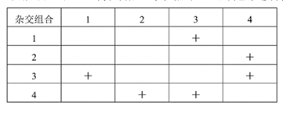

59. 血友病和红绿色盲都是 X-染色体连锁的隐性遗传病，两个基因座相距 12 cM。英国遗传学家 C.V. Green 对患有相关疾病的 Gross 家族进行了调查研究，发现该家族中一位女性（女性甲）共生了 4 个儿子，其中两个患有血友病而色觉正常，另外两个没有血友病却患有红绿色盲。女性甲有一位患有红绿色盲而没有血友病的弟弟，父亲的两个性状都正常。从以上信息，判断下列论述的正误：
    - A. 女性甲中红绿色盲致病基因和血友病致病基因反式排列的概率远高于顺式排列的概率；
    - B. 女性甲的母亲一定携带红绿色盲的致病基因；
    - C. 女性甲的舅父患红绿色盲的概率为 75%； 
    - D. 女性甲的叔父患血友病的概率为 75%。

60. 接上题，女性甲的父亲没有血友病，请判断下列论述的正误：
    - A. 血友病很可能是因为减数分裂时 X 和 Y 染色体不分离造成的；
    - B. 导致血友病的基因突变很可能发生在女性甲所怀胚胎的早期；
    - C. 导致血友病的基因突变很可能发生在女性甲本人发育的早期；
    - D. 导致血友病的基因突变很可能发生在女性甲父亲的生殖细胞。

61~63： 1955 年，遗传学家 J. Walton 对英国某地居民中杜氏肌营养不良（DMD）的病例进行了研究，发现 DMD 患者几乎均为男性，且不会留下后代。将正常基因记为 *D*，其所有致病突变形式均记作 *d*。

61. Walton 认为 DMD 很可能是 X-染色体连锁的隐性遗传病。判断下列相关论述的正误：
    - A. 测定患者家系成员的血型，与表型相对照，有利于确定 DMD 的遗传方式；
    - B. 患者几乎都是男性，是支持 DMD 为 X-染色体连锁的隐性遗传病的证据；
    - C. 因男患者无法留下后代，若有女患者存在，则说明 DMD 是不完全显性遗传病；
    - D. 如果有女子与两任丈夫都生下 DMD 患儿，则可以支持 Walton 的推断。

62. 研究证明，DMD 是 X-染色体连锁的隐性遗传病。表中是对该地 1940~46 年出生的 138403 名男性中 DMD 患者的统计结果，发现群体中 d 基因的频率基本维持稳定。已知人类基因组的每个碱基在每一次代际传递时的突变率约为 $1.1 \times 10^{-8}$。根据这些信息，判断下列相关论述的正误：
    - A. 1940~46 年间该群体中基因型频率基本不变；
    - B. 每一次代际传递，*D* 突变为 *d* 的概率约为 $1.3 \times 10^{-4}$；
    - C. *D* 突变为 *d* 的概率很高，是因为选择压较小；
    - D. 由这些信息可以近似计算 *D* 
    
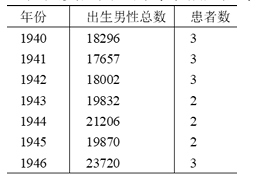

63. Walton 研究了有男性 DMD 患儿的 39 个家庭（每个家庭的孩子都是同父同母），按照每个家庭的男孩数分为甲~庚七类，如下表。根据这些信息，判断下列相关论述的正误：
    - A. 此研究中，男患者数的预期值为 43.5；
    - B. 表中数据的 $\chi^2 = 5.02$ ，相应的 $p \approx 0.03$ ，因此男患者的比例不符合孟德尔分离比；
    - C. 至少在两个家庭中，母亲应该是携带者，基因型为 $X^DX^d$ ；
    - D. 丁类家庭中，母亲的基因型均为 $X^DX^D$ ，她们的生殖细胞发生新突变。

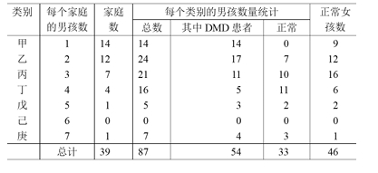

64. 果蝇的棒眼突变表型与染色体特定区域的重复拷贝数有关，这种现象源于减数分裂中同源序列的异位重组（非对等交换）。判断以下陈述的正误：
    - A. 异位重组的发生率与该区域的重组率通常呈正相关；
    - B. 异位重组是染色体微缺失产生的主要诱因之一；
    - C. 该过程仅限于基因组的编码区，内含子或非编码重复序列不会介导此类重组；
    - D. 重复产生的额外拷贝为新功能的产生提供了原材料，受到纯化选择作用。

65. 由于哺乳动物性染色体的继承模式，X 染色体上的非同义碱基替换速率往往高于常染色体。这对理
解性连锁基因的选择动态和二倍体生物的演化优势具有重要意义。判断以下陈述的正误：
    - A. 雄性 X 染色体处于半合子状态，使得有利的隐性突变更易受自然选择作用而固定；
    - B. X 染色体的半合子状态显著提升了自然选择清除有害突变的效率；
    - C. X 染色体在精子发生过程中的重组率通常高于常染色体，是导致其演化更快的根本原因；
    - D. X 染色体比常染色体的突变更易受遗传漂变的影响，使得轻微有害突变更容易通过随机因素固定。

66. 1957 年，研究者报道了“减数分裂驱动”现象：某些基因不遵循孟德尔随机分离定律，而是在配子形
成中“作弊”，使其进入配子的比例显著偏离预期。这种“自私基因”对携带者通常有害。请判断下列陈
述是否合理（合理为正确，不合理为错误）：
    - A. 减数分裂驱动因子可通过偏向性传递、选择性淘汰不含该因子的配子，或抑制其功能等方式，使杂合子产生的配子中该因子的比例显著高于 50%；
    - B. 虽然这种非孟德尔遗传可能降低个体适合度，但就驱动基因本身而言，其在种群中的传播具有选择优势；
    - C. 由于驱动因子常伴随有害效应，基因组其他位置可能演化出抑制因子；
    - D. 减数分裂驱动因子只要能够获得传递优势，通常会在种群中快速固定。

67. 在一些经历过近交、瓶颈或奠基者效应的群体中，研究者观察到平均适合度下降。针对导致这一现象的可能因素，判断以下陈述的正误：
    - A. 近交或瓶颈会提高群体中新生有害突变的产生速率，是遗传负荷快速积累的主要原因；
    - B. 近交会提高隐性有害等位基因以纯合状态出现的概率，从而更容易暴露其有害效应并降低群体平均适合度；
    - C. 在驯化或人工选择过程中，有效群体大小常常下降，遗传漂变增强，使轻微有害突变更不易被清除，因此更容易积累遗传负荷；
    - D. 虽然瓶颈会暂时增加有害突变的频率，但随着种群恢复，这些突变通常会被迅速清除，因此对长期适合度影响有限。

68. 当基因组中出现具有选择优势的突变时，自然选择可推动其在群体中迅速扩散。由于遗传连锁，邻近中性变异也可能随之升高频率并导致局部多态性下降，这称为选择扫荡。研究者常利用当代群体的多态性模式推断历史上的选择扫荡事件。请判断下列陈述的正误：
    - A. 选择扫荡会在受选位点附近形成基因组中的“多样性低谷”；
    - B. 选择扫荡在基因组中高重组率区域的影响范围通常比低重组率区域更小；
    - C. 由于选择扫荡显著提高了受选位点附近的选择压力，有助于增强对有害突变的清除作用，从而降低该区域的遗传负荷；
    - D. 在着丝粒区域，选择扫荡可导致受选位点附近的遗传多态性在更远的距离上受到波及。

69. 人类和猕猴的主要组织相容性复合体基因区域，存在很多在两个物种中都有的等位基因。请判断下列陈述的正误：
    - A. 这些等位基因很可能在两者的共同祖先中已存在，并在物种分化后分别保留于两个谱系中，这提示长期自然选择可能参与维持其多态性；
    - B. 这些跨物种共享的等位基因也可能由人和猕猴的基因交流产生；
    - C. 平衡选择可长期维持多个等位基因，从而使这些古老等位基因在不同物种中独立保留；
    - D. 这些跨物种共享等位基因很可能在人和猕猴中是独立起源的。

70-71. 家犬大约在 1~3 万年前被人类驯化。IGF1 基因在决定家犬体型大小上发挥了关键作用，基因上一个 C/T 多态性位点与体型的相关性最为显著，如下图所示。研究发现，这一位点在家犬的祖先灰狼中同样存在多态性，等位基因频率的分布和灰狼的体型、分布地纬度和温度都存在显著的线性相关性。C 型等位基因在高纬度地区的灰狼中频率约为 10%，在低纬度地区的灰狼中频率约为 40%。

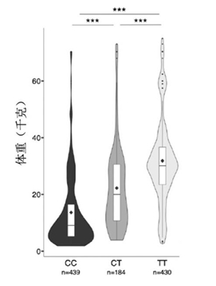

70. 根据上述研究结果，判断下列陈述的正误：
    - A. 小体型家犬中 C 型等位基因频率高于大体型家犬；
    - B. 小体型灰狼中 C 型等位基因频率高于大体型灰狼；
    - C. T 型等位基因相对于 C 型等位基因呈显性；
    - D. 高纬度地区的灰狼体型大于低纬度地区。

71. 进一步研究发现，除灰狼外的其他犬属物种仅携带 C 型等位基因，西伯利亚一只距今 5 万年前的古代灰狼是 CT 杂合个体，基于此判断下列陈述的正误：
    - A. 家犬中的等位基因 C 来自与其他犬属物种的杂交；
    - B. C 型等位基因是祖先型；
    - C. 犬属动物的祖先可能拥有类似灰狼的大体型；
    - D. T 型等位基因是家犬驯化后产生的新突变，灰狼中 T 型来自家犬的基因渗入。

72. 判断下列关于序列比对陈述的正误：
    - A. 多序列比对可以用来发现远缘的进化保守关系；
    - B. 多序列比对可以用来辅助蛋白结构预测；
    - C. 为寻找非同源基因中的同源区域，应采用全局比对；
    - D. blast 软件使用全局比对。
