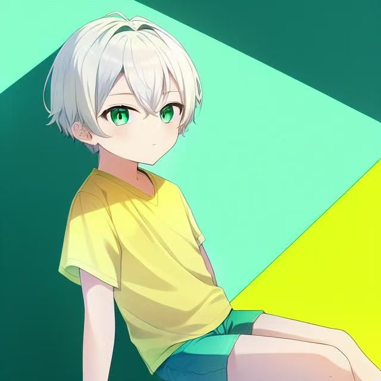
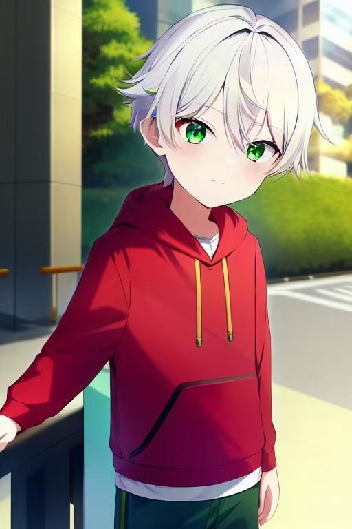
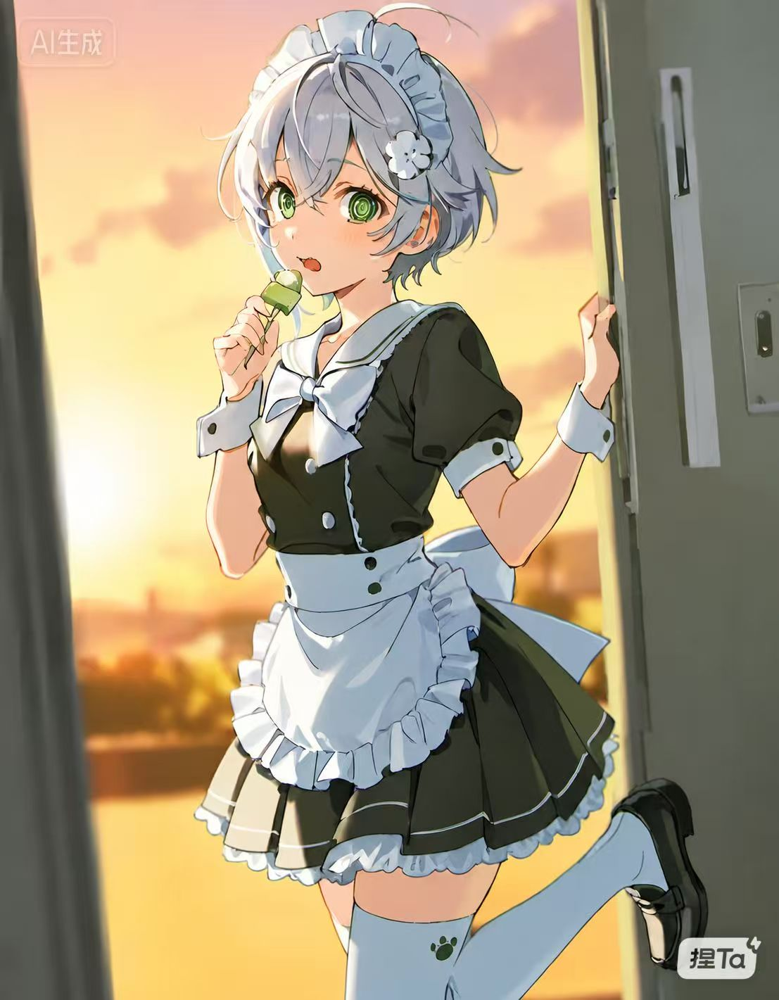
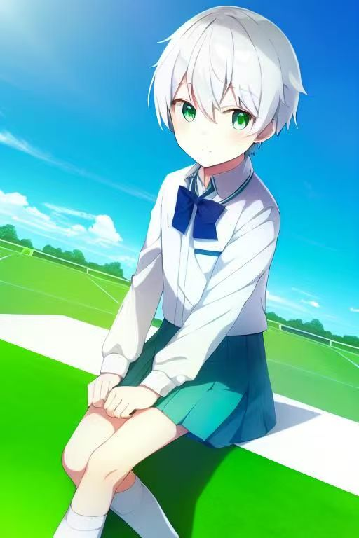
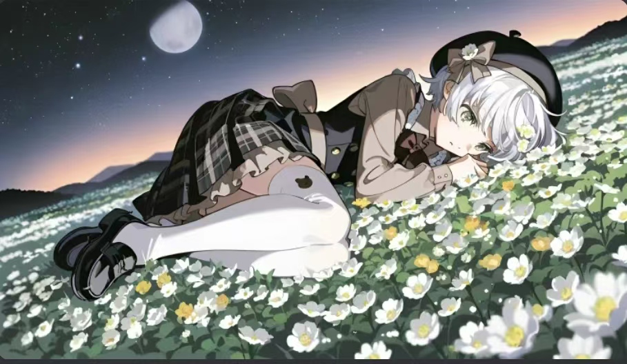
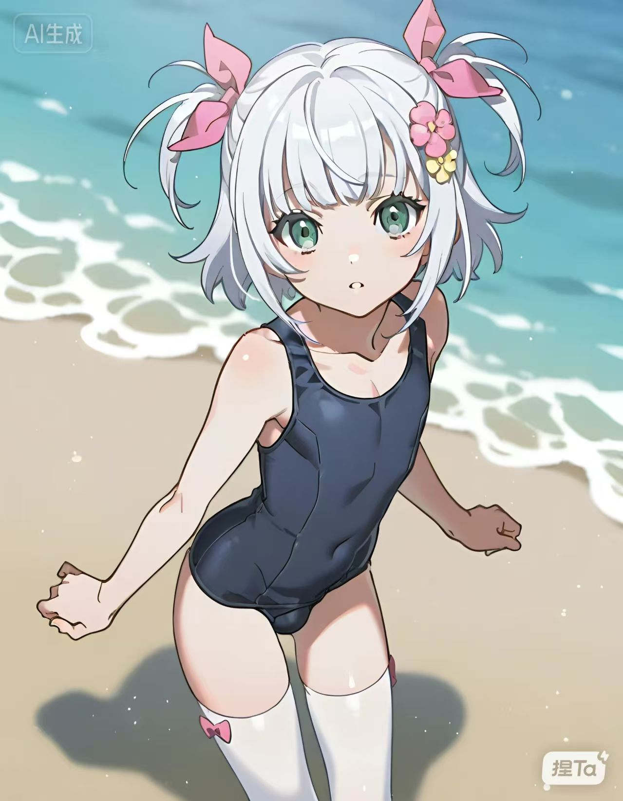

「」

## 前言

前面的情节里好像并没怎么涉及卡洛特的外貌描写，再加上写了卡洛特成绩挺好的，怕有「做题区的幻想」之嫌.这篇主要填一下卡洛特形象的坑，让大家知道其实萝卜被白菜喜欢上不是没有原因的.

## 正文

卡洛特，在No.0时读初二，直接看过去像个乳臭未干的小正太.头发雪白而蓬松，M型刘海之间眨着一双翠绿的眼，颇有「鹤发童颜」之感.他那发型曾经是斜刘海，但据说是因为受了感情上的一些挫折，他把头发剪成了现在这样，显得更幼小了点.他的眼晴，卡贝吉喜欢把它比喻成「一潭炖着心事的汤」，这其实也说明了卡洛特的精神状态起初是挺不稳定的.他的硬伤是他的声音，很粗，反正就是让人没法和他的外表联系在一起.他的身子比较苗条，甚至于看起来有些孱弱，体育不好，经常被人说是「细狗」，这也为白菜把他调成女孩子提供了条件（不过他后面上高中的时候发掘出了自己在长跑上的能力，甚至于还参加了校运会的1500m项目）[^1].

[^1]: 跟池谏个人经历也有关.

其实这个网站的头像就是我们的卡洛特，确实惹人爱.

下面是一些卡洛特的设定图（AI生成，没钱约稿致歉）

事情发生转机.

