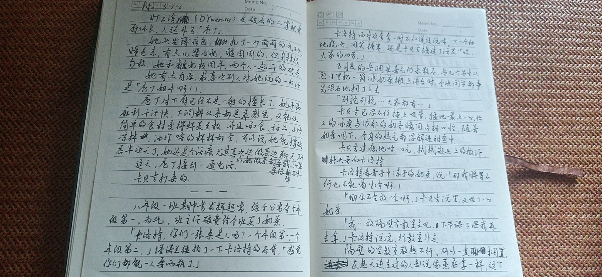
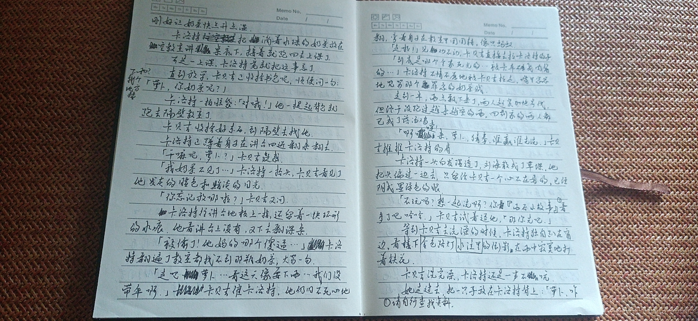
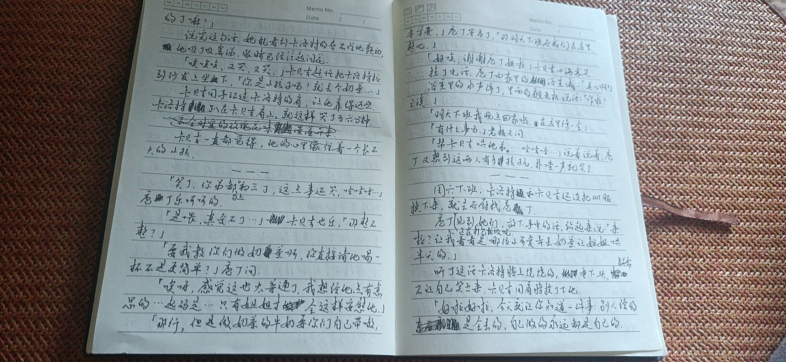
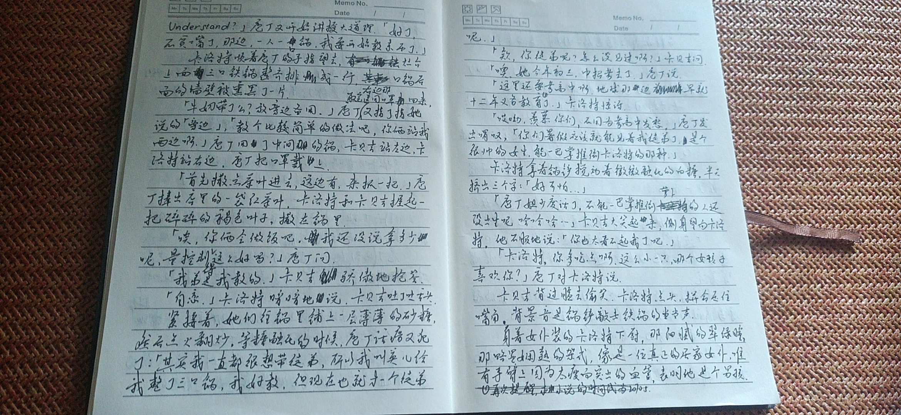
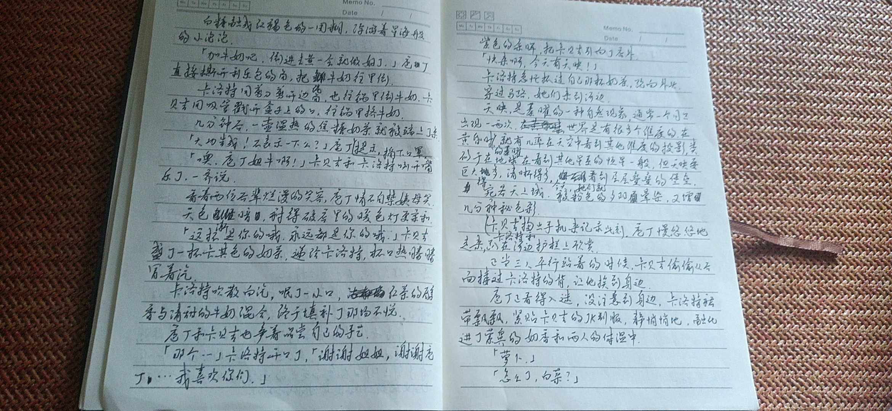

## 池谏的话

国庆节快乐！今天带来一篇长文！

灵感来源是我八月在学校自主学习的时候，有家长给我们买了果茶.但我前段时间看中医，中医说我脾胃不行不能喝生冷，所以我就把果茶放到隔壁空教室里去等回温了.这时我喜欢担心小概率事件的毛病又犯了，我就想会不会有人给我果茶偷了.结果当然是根本无人在意（或者是我藏得比较好），然后突然就有了新文的灵感.

如果卡洛特没那么幸运，会怎样呢？

## 正文

盯云溪**（DYwensy）**是破房的二掌柜兼厨师长，人送外号「庖丁」.

她头发薄荷色，扎了一个萌萌的丸子头，瞳色赤，有点儿婴儿肥，脸肉肉的，但身材很匀称，她和虪老板同年，两个人一起开的破店.

庖丁对下厨已经不是一般地擅长了.她手脚麻利干活快，下调料从来都是靠感觉，却又恰到好处，让简单的食材鲜美至极，并且面食，甜品，小炒，凉拌，油炸啥的样样都会，可以说她能撑破店半边天了.

她有点自恋，最喜欢别人对她说的一句话是：「庖丁姐牛啊！」

她还是个话痨，尤其喜欢边做菜边聊天.为了卫生，她下厨时都要戴口罩.

这天，庖丁接到一通电话.

卡贝吉打来的.

*************

八年级一班期中考发挥超常，综合分勇夺全年级第一，为比，班主任破费给全班买了奶茶.

「卡洛特，你们两姐弟是人吗？一个年级第一一个年级第二.」塔诺兰猛拍了一下卡洛特的后背，「感觉你们都能一人要两瓶了.」

卡洛特嘴笨，面对这夸夸一时不知道该说啥，只一个劲地挠头，用笑搪塞，还是卡贝吉接过了话茬：「唉，大家的功劳.」

五月底的岳澜县暑气仍未散尽.当几个男生从烈日里把一箱冰奶茶搬上讲台时，全班同学都争先恐后地拥了上去.

「别抢别抢...大家都有...」

卡贝吉已忍不住插上吸管，猛地嘬上一口，怡人的冰爽与浓郁的奶香瞬间占据口腔，咽下，浑身的热气都溶解进甜蜜中.

卡贝吉过瘾地哈一口气，拭拭额头上的微汗，转头看向卡洛特.

卡洛特看着手中动手的奶茶，说：「那我脾胃不行，也不能喝生冷啊.」

「那你不会放一会啊，」卡贝吉说罢，又吸了一口奶茶.

「我...放隔壁空教室去吧.下节课下课我再去拿.」卡洛特说完，往教室外去.

隔壁的空教室散热不行，所以一直搁置，在热天进去过的人都说里面像蒸桑拿一样，这下刚好让奶茶快点升温.

卡洛特把摘着水珠的奶茶放在空教室讲桌底下，接着就跑回去上课了.

可是一上课，卡洛特竟就把这事忘了.

亚热带地区的天气多变.正上着课，层云渐渐遮蔽了烈日，窗外变得阴沉.

直到放学，卡贝吉正收拾书包呢，顺便问一句：「萝卜，你奶茶呢？」

卡洛特一拍脑袋：「对哦！」他一提起背包就跑去隔壁教室了.

卡贝吉收拾好东西，到隔壁去找他.

卡洛特正蹲着身子在讲台四近翻来翻去.

「干嘛呢，萝卜？」卡贝吉疑惑.

「我奶茶不见了...」卡洛特一抬头，脸色发灰，目光黯淡.

「你忘记放哪啦？」卡贝吉又问.

卡洛特往讲台地板上一指，还留着一块环形的水痕.他看讲台上没有，又下去翻课桌.

「被偷了！他妈的哪个傻逼...」卡洛特几乎翻遍了教室都找不到那瓶奶茶，大骂一句.

「走吧萝卜...看这天像要下雨...我们没带伞啊.」卡贝吉催卡洛特.他仍旧不死心地翻，弯着身子在教室里团团转，像只找不到家的蚂蚁.

「走啦！」见劝不动，卡贝吉直接去拉卡洛特的手.

卡洛特一步三回头，看着空教室慢慢远去.

「到底是哪个全家死光的...被卡车碾成肉酱的...」卡洛特不情不愿地被卡贝吉拉走，嘴里忿忿咒骂着那个罪恶的奶茶贼.

走到一半，雨点飘下来了，两人赶紧加快步伐，但终于没跑过渐密的雨脚.

回到家的两人都已成了落汤鸡.

「阿嚏！来，萝卜，猜拳，谁赢谁先洗.」卡贝吉推推卡活持的肩.

卡洛特一头白发向下滴着水，刘海散成了草堁.他把头偏过一边去，只留给卡贝吉一个心不在焉的，已经阴成墨绿色的眼.

「不玩吗？想一起洗啊？你看『雨后小故事』[^1]看多了吧哈哈.」卡贝吉试着逗他，「那你先吧.」

卡洛特洗完澡出来，雨没停.他独自趴在窗边，看楼下水洼里金色路灯的倒影，在雨中寂寞地打着铁花.旁边两盆多肉与他作伴.

卡贝吉洗完澡，卡洛特还是一声不吭.

她走过去，把一只手放在卡洛特背上：「萝卜，咋的了嘛？」

说完这句话，她能看到卡洛特的双唇不住地颤动.他吸了吸鼻涕，眼睛已经泛起泪花.

「唉唉唉，又哭，又哭，」卡贝吉赶忙把卡洛特拉到沙发上坐下，「你是小孩子吗？就丢个奶茶...」

卡贝吉用手环过卡洛特的肩，让他靠得近些.

卡洛特趴在卡贝吉肩上，就这样哭了五六分钟.

卡贝吉一直都觉得，卡洛特的心里像住着一个一直长不大的小孩.

**********************

「笑了，你弟都马上初三了，这点事还哭，哈哈哈...」庖丁乐呵呵的.

「是喂，真受不了...」卡贝吉也乐，「那整不整？」

「要我教你们做奶茶啊，你直接请他喝一杯不是更简单？」庖丁问.

「唉呀，感觉这也太普通了，我想给他点有意思的...起码是...只有姐姐才会这样安慰他的.」

「那行，但是做奶茶的牛奶要你们自己带嗷，当学费了.」庖丁答应了，那明天下班后我们在店里整吧.」

「好唉，谢谢庖丁姐啦.」卡贝吉心满意足.

挂了电话，庖丁向家里的浴室喊：「英儿啊！」浴室里的水声停了，里面的虪老板说话：「咋啦？」

「明天下班我晚点回家嗷，在店里待一会.」

「有什么事吗.」老板又问.

「帮卡贝吉哄他弟...哈哈哈...」说着说着，庖丁又想到这两人有多孩子气，噗嗤一声就笑了.

****************

周六下班，卡洛特还穿着女仆装，卡贝吉还穿着JK，就去后厨找庖丁.

庖丁正在打包垃圾呢.见到他们，放下手中的活，站起来说：「来啦？让我着看是哪位小可爱弄丢奶茶让姐姐哄半天的.」

听了这话卡洛特面红耳赤，垂下头，不让自己笑出来.卡贝吉用肩膀挨了下他.

「好啦好啦，今天就让你知道一件事：别人给是会丢的，自己做的永远都是自己的.UNDERSTAND？」庖丁又开始讲授大道理，「好了，不贫嘴了，那边，一人一口锅，我要开始教东西了.」

卡洛特顺着庖丁的手指望去，灶台上面三口铁锅整齐排成一行，右边那口锅后面的墙壁被熏黑了一片.

「牛奶带了么？放旁边备用.」庖丁取完医用口罩回来，指了指她说的「旁边」，「教个比较简单的做法吧，你们回去买个铁观音就能自己做了.你俩站我两边嗷.」庖丁用了中间的锅，卡贝吉站左边，卡洛特站右边，庖丁把口罩戴上.

「首先撒点茶叶进去，这边有，来抓一把.」庖丁捧出店里的一袋红茶叶，卡洛特和卡贝吉握起一把碎碎的褐色叶子，撒在锅里.

「欸，你俩会做饭吧，我还没说拿多少呢，量控制得这么好吗？」庖丁问.

「我弟是我教的.」卡贝吉骄傲地抢答.

「自恋.」卡洛特暗暗地说，卡贝吉吐了吐舌头.

紧接着，她们往锅里铺上一层薄薄的砂糖，然后点火翻炒，等待糖融化的时候，庖丁话痨又犯了：「其实我一直都很想带徒弟，所以我叫英儿给我整了三口锅，我好教，但现在也就才一个徒弟呢.」

「欸？你徒弟呢？怎么没见过啊？」卡贝吉问.

「噢，她今年初三，中招考去了.」庖丁说.

「这里还要考高中啊，地球那边早就十二年义务教育了.」卡洛特惊讶.

「哎呦，羡慕你们，不用为考高中发愁.」庖丁发出喟叹，「你们暑假应该就能见着我徒弟了，是个很帅的女生，能一巴掌推倒卡洛特的那种.」

卡洛特拿看锅铲搅动着微微融化的白糖，半天挤出三个字：「好可怕...」

「庖丁姐少废话了，不能一巴掌推到萝卜的人还没出生呢哈哈哈...」卡贝吉大笑起来，侧身望向卡洛特，他不服地说：「你也太看不起我了吧.」

「卡洛特，你多吃点啊，这么小一只，哪个女孩子喜欢你？」庖丁对卡洛特说.

卡贝吉背过脸去偷笑.卡洛特点头，拼命压住嘴角，背景音是锅铲敲击铁锅的当当声.

身着女仆装的卡洛特下厨，那细腻的翠绿瞳，那略显娴熟的架式，像是一位真正的温柔的居家女仆，唯有手臂上因为太瘦而突出的血管，表明他是个男孩.

白糖融成红褐色的一团糊，浮游着星海般的小泡泡.

「加牛奶吧，倒进去煮一会就做好了.」庖丁直接撕开利乐包的角，把纯牛奶往里倒.

卡洛特用剪刀剪开边角，也往锅里倒牛奶.卡贝吉用吸管戳开盒子上的口，往锅里挤牛奶.

几分钟后，一壶温热的焦糖奶茶就被端上了桌.

「大功告成！不表示一下么？」庖丁摘下口罩，提示.

「庖丁姐牛啊！」卡贝吉和卡洛特乐开了花，一齐说.

看着两位后辈烂漫的笑容，庖丁情不自禁姨母笑.天色渐暗，衬得破店里的暖色灯更柔和.

「这杯是你的哦，永远都是你的哦.」卡贝吉盛了一杯卡其色的奶茶，递给卡洛特，杯口热腾腾冒着汽.

卡洛特吹散白汽，呡了一小口，裹挟着红茶的醇香与牛奶的甘甜，一股暖流直流入卡洛特心中，终于弥补了那场不悦.

庖丁和卡贝吉也争着品尝自己的手艺.

「那个...」卡洛特开口了，「谢谢姐姐，谢谢庖丁....我喜欢你们.」

暖色的灯光，烘托着欢声笑语.

紫色的余晖，把卡贝吉引向了店外.

「快来啊，今天有天映！」

卡洛特急忙抓过自己那杯奶茶，跑向外头.

穿过马路，她们来到河边.

**天映**，是蓁曜的一种自然现象，通常一个月只出现一两次.世界是有很多个维度的.在黄昏时的蓁曜，就有几率在天空中看到其他维度的投影，类似于在地球在看到其他星系的恒星一般，但天映更像海市蜃楼，并且要巨大得多，清晰得多.

今天，她们就在空中看到层层叠叠的堡垒，宛若天上城，被粉色的夕阳晕染，又增几分神秘色彩.

卡洛特卡贝吉掏出手机来记录此刻，庖丁慢悠悠地走来，趴在河边护栏上欣赏.

时间仿佛停止了.

正当三人平行站着的时候，卡贝吉偷偷从后面搂过卡洛特的背，让他挨到身边.

庖丁看得入迷，没注意到身边，卡洛特裙带飘飘，紧贴卡贝吉的JK制服，静悄悄地，融化进了馥郁的奶茶香和两人的体温中.

「萝卜.」

「怎么了，白菜？」

「你知道你的眼泪有玫瑰花味吗？」

[^1]: 请自行查找资料.

## 彩蛋

